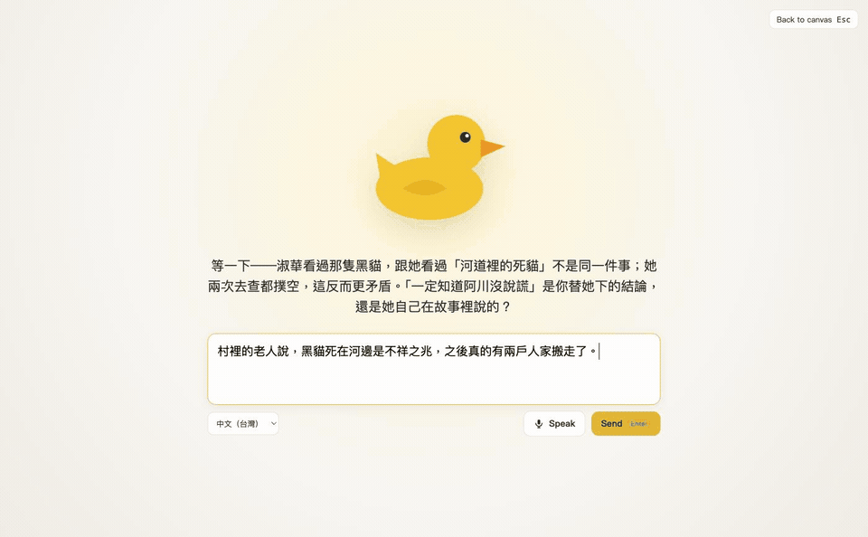
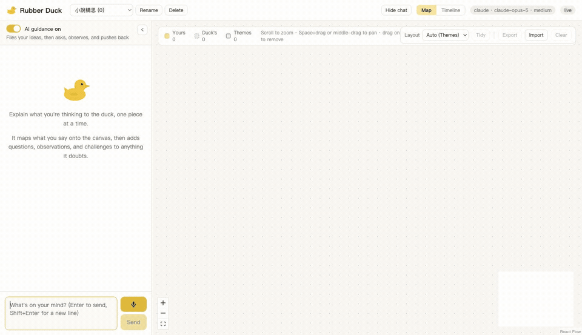
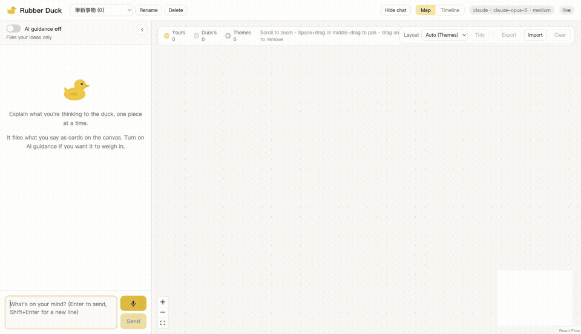

# Quack Aloud

> status: MVP，單人使用、只在本機執行

Quack Aloud 是一個帶畫布的「橡皮鴨除錯法」工具。你在聊天欄一段一段說出自己對某件事的理解，LLM 把這些片段拆成卡片、歸入主題，並在旁邊的無邊際畫布上畫出彼此的關係。**AI guidance** 關閉時它只做整理；開啟時鴨子會再補上自己的追問、觀察與質疑，並標示為它自己的。本文件給要執行或擴充這個 app 的人看。English version: [README.md](README.md)。

不在本文件：
- Claude Code 直接改畫布的做法：見 [CLAUDE.md](CLAUDE.md)

## Demo

| 情境 | 發生什麼 |
|---|---|
|  | **跟鴨子說話**。按「Talk to the duck」進舞台：在大鴨子下面打字（或用說的）、送出、看牠思考、回覆直接出現在牠下面；回到畫布時新卡片已經歸好。這段裡牠質疑「凶兆傳開之後兩戶人家搬走」的因果方向 |
|  | **構思故事**（guidance 開）。丟進三段懸疑故事的片段；鴨子把人物、事件、說法各自歸檔，自動選用 Timeline 版面，第三句從「她看過貓」跳到「所以他沒說謊」時，鴨子用一張 challenge 卡回嘴 |
|  | **學新東西**（guidance 先關後開）。關於 TOPS 的筆記變成有中介概念的心智圖；開啟 guidance 後說「TOPS 越高一定越快」，被質疑 INT8 與 FP16 基準不同、還要看記憶體頻寬 |

## 運作方式

| 元件 | 做什麼 | Note |
|---|---|---|
| `data/projects/<id>.json` | 一個專案一個檔：名稱、主題、卡片、關係、對話紀錄、版面 | 唯一的資料來源。所有寫入者（聊天 API、瀏覽器編輯、Claude Code、文字編輯器）都寫這些檔。舊版的 `data/graph.json` 會在啟動時搬成第一個專案 |
| `server/` | 跑在 `API_PORT` 的 Express API | 監看 `data/projects/`，每次變動用 SSE（`/api/events`）推給瀏覽器 |
| `server/providers/` | LLM 後端 | 用 `PROVIDER` 切換。目前只有 `claude` |
| `src/` | Vite + React + React Flow 的 UI | 左邊聊天、右邊畫布 |
| `CLAUDE.md`、`.agents/` | 讓 coding agent 不用 API key 就能當鴨子的規則 | Claude Code 讀 `CLAUDE.md`；Google Antigravity 讀 `.agents/rules/quack-aloud.md`，並從 `.agents/workflows/duck.md` 取得 `/duck` workflow。跑 `npm run dev`、在瀏覽器開好專案，再把想法打給 agent（兩邊都可用 `/duck …`；Claude Code 直接打字也行；加「guide」或「引導」會得到追問與質疑）。它會改專案檔，畫布即時更新，費用走 agent 自己的方案而不是 Gemini 或 Claude 的 API key |

## 開始使用

1. `npm install`
2. `cp .env.example .env`
3. 把 Anthropic API key 填進 `.env` 的 `ANTHROPIC_API_KEY`（到 console.anthropic.com 建立；按 token 計費，和 Claude.ai 訂閱分開）
4. `npm run dev`
5. 開 http://localhost:5173
6. 輸入類似「首頁載入很慢，我猜是資料庫的問題」然後按 Enter。你會看到兩張黃色卡片在一個淡色主題容器裡、中間一條邊，以及一句「歸了什麼」的回覆
7. 開啟聊天欄上方的 **AI guidance**，再送一句想法。這時會多出一兩張鴨子的藍色虛線卡，回覆也變成口語的兩三句

沒有 API key 也可以試畫布：用畫布右上角的 Import 匯入 `data/sample-graph.json`，它會變成一個新專案。

## 用 Docker 執行

一個 image 同時在 8787 服務 API 和 build 好的 UI；專案資料放在 volume。

| 步驟 | 指令 | Note |
|---|---|---|
| 1 | `cp .env.example .env`，填入 `ANTHROPIC_API_KEY` | container 透過 `docker compose` 讀 `.env` |
| 2 | `docker compose up --build` | 建 image 並啟動；開 http://localhost:8787 |
| 3 | 資料就是 dev server 用的同一個 `./data/` | `projects/`、`trash/`、備份。Claude Code 與 Antigravity 路線照常可用：它們改 host 上的 `data/projects/<id>.json`，container 裡的 watcher 收得到（在 Mac 的 Docker Desktop 驗證過；Linux 上檔案擁有者會是 uid 1000）。要放別的路徑就掛到 `/data` |

不用 compose 的話：`docker build -t quack-aloud .`，然後 `docker run -p 8787:8787 -e ANTHROPIC_API_KEY=... -v $PWD/data:/data quack-aloud`。

Kubernetes：`deploy/k8s/quack-aloud.yaml` 是最小的 Deployment + Service + PVC。狀態是檔案，所以只能單一 replica 配 ReadWriteOnce volume（`strategy: Recreate`），API key 從 Secret 來。對外開放前一定要放在有認證的 Ingress 後面，因為每則訊息都花 API 額度。驅動即時更新的 `fs.watch` 在某些網路檔案系統上不會觸發，請用 block volume，不要用 NFS。coding agent 的路線需要檔案和 agent 在同一台機器上，所以只適用本機 Docker，不適用叢集。

## 讓 coding agent 當鴨子（不用 API key）

Claude Code 和 Google Antigravity 可以直接改開啟中的專案檔來扮演鴨子。畫布和 app 內的聊天欄都會即時更新，費用算在 agent 自己的方案，不是 API key。

| 步驟 | Claude Code | Antigravity | Note |
|---|---|---|---|
| 1 | 在 Claude Code 開這個資料夾（Claude app 的 Code 分頁，或終端機的 `claude`） | 把這個資料夾當 workspace 開啟 | Claude Code 載入 `CLAUDE.md`；Antigravity 載入 `.agents/rules/quack-aloud.md`。兩份的規則和檔案格式相同 |
| 2 | `npm run dev` 並開 http://localhost:5173 | 同左 | agent 透過 `http://localhost:8787/api/projects` 找到開啟中的專案 |
| 3 | 直接打想法，或 `/duck <想法>` | 在 agent panel 打 `/duck <想法>` | `/duck` 把意圖講明；Claude Code 直接打字也可以。指令清單在對話開始時讀取，clone 或 pull 之後要開新對話 `/duck` 才會出現 |
| 4 | 訊息裡加「guide」「引導」或「質疑」會得到追問與質疑 | 同左 | 不加就只整理 |
| 5 | 說「new project: <名稱>」或「開新專案：<名稱>」開一張新畫布 | 同左 | agent 會建 `data/projects/p-<日期>-<時間>.json` 並把訊息其餘部分歸進去。到選單切換過去 |

兩條路和 app 內的聊天寫的是同一批檔案，可以混用。避免在 agent 寫檔的同一刻在瀏覽器拖卡片；瀏覽器會拒絕過期的寫入並顯示「canvas changed elsewhere」。

## 設定（`.env`）

| Key | Default | Note |
|---|---|---|
| `ANTHROPIC_API_KEY` | | `claude` provider 必填 |
| `PROVIDER` | `claude` | **Optional**。`server/providers/index.ts` 裡登記的名稱 |
| `CLAUDE_MODEL` | `claude-opus-5` | **Optional** |
| `CLAUDE_EFFORT` | `medium` | **Optional**。`low` / `medium` / `high` / `xhigh` / `max`。越高越慢也越貴 |
| `API_PORT` | `8787` | **Optional**。Vite dev server 會把 `/api` 代理到這個 port |
| `DATA_DIR` | `./data` | **Optional**。放 `projects/` 和 `trash/` 的資料夾。Docker image 設為 `/data` |

## 專案

| 控制項 | 位置 | 做什麼 | Note |
|---|---|---|---|
| 專案選單 | 頂欄標題旁 | 切換專案。每個專案有自己的畫布和對話 | 最後開啟的專案會記在瀏覽器裡 |
| + New project… | 選單最後一項 | 輸入名稱、Enter | 從空白開始 |
| Rename / Delete | 選單旁 | 原地改名；Delete 會原地問一次 | 刪掉的專案搬到 `data/trash/<id>-<時間>.json`，不會真的刪除；複製回 `data/projects/` 就能還原。刪掉最後一個專案會自動建一個空的 |

## 模式與檢視

| 控制項 | 位置 | 做什麼 | Note |
|---|---|---|---|
| AI guidance 開關 | 聊天欄上方 | 兩種模式都會整理：卡片、主題、關係、既有卡片的修訂。**關**（Default）：只做整理，回覆是一句「歸了什麼」。**開**：鴨子會再加 question / insight / to-verify / challenge 卡片，並用口語回覆，有疑慮就回嘴 | server 端強制：關閉時任何 question / insight / to-verify 卡片都會被丟掉，含問句的回覆會換成固定摘要 |
| Map / Timeline | 頂欄 | **Map**：自由畫布。**Timeline**：同一批卡片依「哪一句話產生」分組，照你說的順序排 | 兩者讀同一個專案檔；選擇會記在瀏覽器裡 |
| Layout（Map 上） | 畫布右上角 | 卡片怎麼排。**Auto**（Default）跟隨鴨子對內容的建議；或固定一種：**Themes**（一主題一欄，有容器）、**Layered**（依邊的方向由左到右分層，適合因果與依賴）、**Timeline**（有編號的時間軸穿過事件，泳道各有標籤：人與物在上、說法與信念在下、鴨子的筆記在最下；適合故事與流程）、**Mind map**（從核心概念向兩側展開的樹，適合知識；優先沿「是一種」「屬於」「part of」這類階層關係走，所以中介概念卡會變成層次） | 切換會立刻重排。每輪鴨子回覆後畫布會用目前版面重排，Themes 例外，新卡片只是排進所屬主題的欄位 |

## 聊天

| 功能 | Note |
|---|---|
| 訊息送出立刻顯示，標「Sending…」 | 鴨子回覆後換成存檔的那一則 |
| 鴨子思考中可以繼續打字 | Enter 或「Queue」把訊息排進佇列，一次送一則、依序處理。某一則失敗時，它和排在後面的都會退回輸入框 |
| 跟鴨子說話 | 聊天欄最下方的「Talk to the duck」打開滿版舞台：一隻大鴨子、牠最新的回覆在下面、一個大輸入框可以打字或說話。Enter 送出（舞台不關，鴨子直接在這裡回）、Shift+Enter 換行、Esc 回到畫布 |
| 語音輸入 | 舞台上的「Speak」用瀏覽器內建的語音辨識（Chrome、Edge、Safari）。鴨子會隨你的音量跳動放大，說的話即時出現在輸入框。按鈕旁可選辨識語言（Default：中文瀏覽器是「中文（台灣）」，否則跟隨瀏覽器語言），選擇會記住。不支援的瀏覽器不會顯示 |

## 使用畫布

| 動作 | 怎麼做 |
|---|---|
| 自己加卡片 | 雙擊空白處，輸入標題，Enter（Esc 取消） |
| 連接兩張卡 | 從卡片右側的圓點拖到另一張卡 |
| 改標題 | 雙擊卡片，輸入，Enter |
| 移動卡片 | 拖曳。位置會存檔 |
| 多選 | 在空白處拖出框（碰到卡片即算選中），或 Shift + 點擊。拖任一張選中的卡會一起移動 |
| 平移 / 縮放 | 滾輪或 pinch 以游標為中心縮放；按住 Space 拖曳、或中鍵 / 右鍵拖曳平移 |
| 刪除 | 選取後按 Backspace 或 Delete |
| 全部重排 | 右上角「Tidy」，用目前版面 |
| 存一份 | 右上角「Export」。下載目前專案（含對話）成 `quack-aloud-<專案>-<日期>.json` |
| 載入一份 | 右上角「Import」。從匯出檔建立新專案並切換過去，不會覆蓋任何東西。任何合法的專案檔都可以，手寫的也行 |
| 重來 | 右上角「Clear」，再按「Really clear everything?」確認。清空目前專案的內容但保留專案 |
| 收起聊天欄 | 頂欄的「Hide chat」，或聊天欄上的 ‹。畫布佔滿寬度；選擇會記在瀏覽器裡 |

| 外觀 | 意義 |
|---|---|
| 黃色實線卡 | 你說的內容（`origin: "user"`），拆成組成部分：**膠囊**是 entity（人、物、地點），**帶方形標記的卡**是 event，**引號卡**是 claim 或信念。滑到卡片上會顯示它來自你哪一句話 |
| 藍色虛線卡 | 鴨子補的（`origin: "ai"`）：追問、洞見或待確認的事。只在 guidance 開時出現 |
| 紅色虛線卡，帶「!」 | challenge：鴨子對你說的有疑慮（和畫布矛盾、沒說出口的假設、從證據跳到結論）並說明理由。用「challenges」連到被質疑的卡。只在 guidance 開時出現 |
| 帶標題的淡色容器 | 鴨子歸出的主題。新卡片排在所屬主題底下；「Tidy layout」會排成一主題一欄 |
| 實線邊 | 你自己說出的關係 |
| 虛線邊 | 鴨子從內容推斷的關係 |

## Scripts

| 指令 | 做什麼 |
|---|---|
| `npm run dev` | API server 加 Vite，含 hot reload |
| `npm run build` | 先 typecheck，再把 UI build 到 `dist/` |
| `npm start` | 用一個 process 在 `API_PORT` 同時服務 API 和 build 好的 UI（先跑 `npm run build`） |
| `npm run docker:build` / `npm run docker:run` | 建 image / 用 compose 建並啟動 |
| `npm run typecheck` | `tsc --noEmit` |
| `npm test` | Vitest 單元測試：graph 合併邏輯、prompt 組裝、四種版面。`npm run test:watch` 會在檔案變動時重跑 |

## 加另一個 LLM provider

1. 建 `server/providers/<name>.ts`，實作 `server/providers/types.ts` 的 `ThinkProvider`。`think()` 收到組好的 system prompt、最近的對話和使用者這一輪，必須回傳符合 `ThinkOutputSchema` 的物件
2. 在 `server/providers/index.ts` 的 `REGISTRY` 登記
3. 在同一個檔案的 `describeProviderError` 補上該 SDK 的錯誤對應
4. `.env` 設 `PROVIDER=<name>`

prompt 本身在 `server/prompt.ts`，所有 provider 共用。

## Troubleshooting

| 症狀 | 原因 | 處理 |
|---|---|---|
| 聊天欄顯示「No credentials for provider」 | 沒有 `.env` 或 key 是空的 | 填好 `ANTHROPIC_API_KEY`，重跑 `npm run dev` |
| 右上角顯示「disconnected」 | API server 沒跑，或跑在別的 port | 看終端機的 `[server]` 那幾行；對齊 `API_PORT` |
| 手改專案檔後畫布變空 | JSON 不合法，或卡片缺 `id` / `label` | server 會略過讀不了的檔、丟掉壞的項目；修好 JSON 再存一次 |
| 專案從選單消失 | 檔案被刪，或被改成 `<id>.json` 以外的名稱（小寫字母、數字、連字號） | 用合法名稱放回 `data/projects/` |
| Claude Code 說「Unknown command: /duck」 | 對話開始時 `.claude/commands/duck.md` 還不存在；指令在對話開始時讀取 | 開新對話，或不加 `/duck` 直接打想法（CLAUDE.md 已經教 Claude Code 怎麼歸檔） |
| Antigravity 的 `/duck` 沒反應 | 沒吃到 `.agents/workflows/duck.md` | 確認這個資料夾是 workspace 根目錄；舊的 `.agent/` 名稱也接受 |

## License

MIT，見 [LICENSE](LICENSE)。
